<link rel="stylesheet" href="../styles.css">

# 🟪 Foundations Course

## 📜 Table of Contents 📜

- [🧠 1 Prerequisites](#---1-prerequisites)
  * [🟦 1.1 How Does the Web Work](#---11-how-does-the-web-work)
    + [🔴 1.1.1 Introduction](#---111-introduction)
    + [🔴 1.1.2 Lesson Overview](#---112-lesson-overview)
    + [🔴 1.1.3 How Does the Internet Work?](#---113-how-does-the-internet-work-)
    + [🔴 1.1.4 Difference between Webpage, Website, Web server and Search Engine?](#---114-difference-between-webpage--website--web-server-and-search-engine-)
    + [🔴 1.1.5 How the Web interacts](#---115-how-the-web-interacts)
  * [🟦 1.2 Installation Overview](#---12-installation-overview)
    + [🔴 1.2.1 Introduction](#---121-introduction)
  * [🟦 1.3 Installations](#---13-installations)
  * [🟦 1.4 Command Line Basics](#---14-command-line-basics)
    + [🔴 1.4.1 Lesson Overview](#---141-lesson-overview)
    + [👨‍💻 Assignment - Unix Shell Course 👨‍💻](#------assignment---unix-shell-course------)
      - [📜 Instructions 📜](#---instructions---)
      - [💻 Commentary 💻](#---commentary---)
  * [🟦 1.5 Setting up Git](#---15-setting-up-git)
    + [🔴 1.5.1 Configure Git and GitHub](#---151-configure-git-and-github)
      - [⭐ Setup Git ⭐](#--setup-git--)
      - [⭐ Create an SSH Key ⭐](#--create-an-ssh-key--)
      - [⭐ Testing Your Key ⭐](#--testing-your-key--)
- [🧠 2 Git Basics](#---2-git-basics)
  * [🟦 2.1 Introduction to Git](#---21-introduction-to-git)
    + [🔴 2.1.1 Introduction](#---211-introduction)
  * [🟦 2.2 Git Basics](#---22-git-basics)
    + [👨‍💻 2.2.1 Assignment - Git Basics 👨‍💻](#------221-assignment---git-basics------)
      - [📜 Instructions 📜](#---instructions----1)
      - [👨‍💻 Commentary 👨‍💻](#------commentary------)
- [🧠 3 HTML Foundations](#---3-html-foundations)
  * [🟦 3.1 Introduction to HTML and CSS](#---31-introduction-to-html-and-css)
    + [🔴 3.1.1 Introduction](#---311-introduction)
  * [🟦 3.2 Elements and Tags](#---32-elements-and-tags)
  * [🟦 3.3 HTML Boilerplate](#---33-html-boilerplate)
    + [🔴 3.3.1 Creating an HTML File](#---331-creating-an-html-file)
    + [🔴 3.3.2 The DOCTYPE](#---332-the-doctype)
    + [🔴 3.3.3 HTML Element](#---333-html-element)
    + [🔴 3.3.4 Head Element](#---334-head-element)
    + [🔴 3.3.5 Body Element](#---335-body-element)
    + [🔴 3.3.6 Viewing HTML Files in Browser](#---336-viewing-html-files-in-browser)
  * [🟦 3.4 Working with Text](#---34-working-with-text)
    + [🔴 3.4.1 Paragraphs](#---341-paragraphs)
    + [🔴 3.4.2 Headings](#---342-headings)
    + [🔴 3.4.3 Strong Element](#---343-strong-element)
    + [🔴 3.4.4 Em Element](#---344-em-element)
    + [🔴 3.4.5 Nesting and Indentation](#---345-nesting-and-indentation)
    + [🔴 3.4.6 HTML Comments](#---346-html-comments)
  * [🟦 3.5 Lists](#---35-lists)
    + [🔴 3.5.1 Unordered Lists](#---351-unordered-lists)
    + [🔴 3.5.2 Ordered Lists](#---352-ordered-lists)
    + [👨‍💻 3.5.3 Assignment - Lists 👨‍💻](#------353-assignment---lists------)
      - [📜 Instructions 📜](#---instructions----2)
      - [💻 Commentary 💻](#---commentary----1)
  * [🟦 3.6 Links and Images](#---36-links-and-images)
    + [🔴 3.6.1 Anchor Elements](#---361-anchor-elements)
    + [🔴 3.6.2 Absolute and Relative Links](#---362-absolute-and-relative-links)
    + [🔴 3.6.3 Images](#---363-images)
    + [🔴 3.6.4 Parent Directories](#---364-parent-directories)
    + [🔴 3.6.5 Alt Attribute](#---365-alt-attribute)
    + [🔴 3.6.6 Four Main Image Formats](#---366-four-main-image-formats)
  * [🟦 3.7 Project - Recipes](#---37-project---recipes)
- [🧠 4 CSS Foundations](#---4-css-foundations)
  * [🟦 4.1 Introduction to CSS](#---41-introduction-to-css)
    + [🔴 4.1.1 Introduction](#---411-introduction)
    + [🔴 4.1.2 Scrimba Example](#---412-scrimba-example)
    + [🔴 4.1.3 Selectors](#---413-selectors)
      - [⭐ Grouping Selectors ⭐](#--grouping-selectors--)
      - [⭐ Chaining Selectors ⭐](#--chaining-selectors--)
      - [⭐ Descendant Combinator ⭐](#--descendant-combinator--)
    + [🔴 4.1.4 Order Matters](#---414-order-matters)
    + [🔴 4.1.5 Properties to Get Started With](#---415-properties-to-get-started-with)
      - [⭐ Color and Background-Color ⭐](#--color-and-background-color--)
      - [⭐ Typography Basics and Text-Align ⭐](#--typography-basics-and-text-align--)
      - [⭐ Image Height and Weight ⭐](#--image-height-and-weight--)
    + [🔴 4.1.6 Adding CSS to HTML](#---416-adding-css-to-html)
      - [⭐ External CSS ⭐](#--external-css--)
      - [⭐ Internal CSS ⭐](#--internal-css--)
      - [⭐ Inline CSS ⭐](#--inline-css--)
    + [👨‍💻 4.1.7 Assignment - CSS Exercises 👨‍💻](#------417-assignment---css-exercises------)

<hr>

# 🧠 1 Prerequisites

## 🟦 1.1 How Does the Web Work

### 🔴 1.1.1 Introduction

* This section will provide a hollistic overview of how the web works.

### 🔴 1.1.2 Lesson Overview

* Describe what the internet is

* Describe what packets are and how they are used to transfer data

* Understand the differences between a web page, web server, web browser and search engine.

* Explain what a client and server is

* Explain what IP addresses and DNS servers are,

### 🔴 1.1.3 How Does the Internet Work?  

* The internet is a large netwrok of computers which can communicate together.

* A network between two computers can be achieved through an ethernet cable. 

* If we wanted ten computers to communicate with each other, it would not be efficient for them to all have ethernet cables going to all other computers. To solve this issue, we let the computers connect to a `router` which ensures messages are sent to the correct recieptant.


### 🔴 1.1.4 Difference between Webpage, Website, Web server and Search Engine?

* `Web page` - a document which can be displayed in a browser

* `Website` - A collection of web pages

* `Web server` - the host of a website

* `Search Engine` - A web service which lets you find other web pages

### 🔴 1.1.5 How the Web interacts

* Computers connected to the internet are called `clients` and `servers`

* We also have:

1) `Your internet connection` - allows you to send and receive data on the web

2) `TCP/IP` - The Transmission Control Protocol and Internet Protocol are communication protocols are protocols which define how data is transmitted over the internet.

3) `DNS` - The Domain Name System allows the browser to find the websites IP address. This is needed for before a HTTP message is sent. The DNS is a mapping from the IP address (e.g. `63.245.215.20`) to the URL of the website

4) `HTTP` - this is a protocol which defines a language for clients and servers to speak to each other.

5) `Component files` - these are the front-end files and assets which makeup a website

<br>

## 🟦 1.2 Installation Overview

### 🔴 1.2.1 Introduction

* We will look at setting up the development environment!

* The Odin Project does not support Windows natively, so we shall look at:

- installing a supported OS
- Installing Chrome and code editor
- Creating SSH key

<br>

## 🟦 1.3 Installations

* I abandon th Linux installation and decide to just install Linux for Windows

* I open up powershell and execute:

```
PS C:\Users\shiv_> wsl --install
The requested operation requires elevation.
Installing: Virtual Machine Platform
Virtual Machine Platform has been installed.
Installing: Windows Subsystem for Linux
Windows Subsystem for Linux has been installed.
Installing: Ubuntu
Ubuntu has been installed.
The requested operation is successful. Changes will not be effective until the system is rebooted.
PS C:\Users\shiv_>
```

* I reboot my computer, and set the username and password!

* Already have VSCode installed and will use it as my code editor

<br>

## 🟦 1.4 Command Line Basics

### 🔴 1.4.1 Lesson Overview

* Describe what the commannd line is and open the command line on your computer

* Use the command line to navigate directories and display directory contents

* Use the command line to create a new directory and a new file

* Use the command line rename or destroy a directory and a file

* Use the command line to open a file or folder in a program


### 👨‍💻 Assignment - Unix Shell Course 👨‍💻

#### 📜 Instructions 📜

1) Visit [The Unix Shell course](https://swcarpentry.github.io/shell-novice/) designed by the Software Carpentry Foundation. There you will find a full complement of lessons on using the CLI, but for now just focus on completing the following lessons:

  - Setup 
  - Introducing the Shell
  - Navigating Files and Directories
  - Working With Files and Directories
  - Pipes and Filters

#### 💻 Commentary 💻

* I work through the exercises. Here are my notes

- We can list files recursively using `-R` option

- The `-F` option adds additional information to the files to indicate if they are directory, link, executable etc

```sh
$ ls -F
LittleWomen.txt*  haiku.txt*  thesis/
```

- The `mv` command lets you specify a file and move it to a new location. E.g. here I move the `quotes.txt` in the `thesis` directory into current directory:

```sh
$ ls
LittleWomen.txt  haiku.txt  thesis
$ ls thesis/
draft.txt
$ mv thesis/draft.txt .
$ ls
LittleWomen.txt  draft.txt  haiku.txt  thesis
```

- The `mv` command also lets you rename

- The `cp` command lets you copy a file. E.g. I copy haiku.txt to /thesis

```sh
cp haiku.txt thesis/
$ ls haiku.txt thesis/haiku.txt
haiku.txt  thesis/haiku.txt
```

- We can copy a directory recursively (including files and subdirectories) using the `-r` option:

```sh
$ cp -r thesis/ thesis_backup
$ ls thesis_backup/
haiku.txt
```

- We can remove files using `rm` command:

```sh
$ rm haiku.txt
```

- We can use `rm` safely by using the `-i` option, which will require the user to confirm

```sh
$ rm -i haiku.txt
rm: remove regular empty file 'haiku.txt'? y
```

- In order to delete a directory and contents, we MUST use the recursive option `-r`:

```sh
$ ls thesis
haiku.txt
$ rm thesis
rm: cannot remove 'thesis': Is a directory
$ rm -r thesis
$ ls thesis
ls: cannot access 'thesis': No such file or directory
```

- We can copy multiple files to a directory GIVEN the final argument is a directory:

```sh
$ ls
alkanes  animal-counts  creatures  numbers.txt  project  writing
$ mkdir
 backup
$ cp creatures/minotaur.dat creatures/unicorn.dat backup/
$ ls backup/
minotaur.dat  unicorn.dat
```

- `*` is a wildcard for 0+ characters, `?` is a wildcard for 1 character exactly

- The `wc` command prints out number of lines words and characters in files:

```sh
$ pwd
/mnt/c/Users/shiv_/Documents/GitHub/TheOdinProject/0 Foundations Course/shell-lesson-data/exercise-data/alkanes
$ ls
cubane.pdb  ethane.pdb  methane.pdb  octane.pdb  pentane.pdb  propane.pdb
$ wc cubane.pdb
  20  156 1158 cubane.pdb
```

* We use `-l` option to just display the number of lines>:

```sh
$ wc -l *.pdb
  20 cubane.pdb
  12 ethane.pdb
   9 methane.pdb
  30 octane.pdb
  21 pentane.pdb
  15 propane.pdb
 107 total
```

- Which file contains the fewest lines? We can redirect the result of the `wc` command using `>`:

```sh
$ wc -l *.pdb > length.txt
$ ls
cubane.pdb  ethane.pdb  length.txt  methane.pdb  octane.pdb  pentane.pdb  propane.pdb
```

- We sort the results of the length.txt file using `sort -n` where `-n` sorts numerically:

```sh
$ sort length.txt -n
   9 methane.pdb
  12 ethane.pdb
  15 propane.pdb
  20 cubane.pdb
  21 pentane.pdb
  30 octane.pdb
 107 total
 ```

 * I use the `head` command to get the top n lines of the file:

```sh
$ sort length.txt -n > sorted-lengths.txt
$ head -n 1 sorted-lengths.txt
   9 methane.pdb
```

- We use `echo` to create text and output to a file:

```sh
$ echo this is the start of my sentence
this is the start of my sentence
$ echo hello > testFile.txt
$ echo line2 >> testFile.txt
$ head -n 2 testFile.txt
hello
line2
```

- We can use `|` pipe to pass output of one command to another:

```sh
$ sort -n length.txt
   9 methane.pdb
  12 ethane.pdb
  15 propane.pdb
  20 cubane.pdb
  21 pentane.pdb
  30 octane.pdb
 107 total
$ sort -n length.txt | head -n 1
   9 methane.pdb
```

* We can pipe consecutively:

```sh
$ wc -l *.pdb
  20 cubane.pdb
  12 ethane.pdb
   9 methane.pdb
  30 octane.pdb
  21 pentane.pdb
  15 propane.pdb
 107 total
$ wc -l *.pdb | sort -n
   9 methane.pdb
  12 ethane.pdb
  15 propane.pdb
  20 cubane.pdb
  21 pentane.pdb
  30 octane.pdb
 107 total
$ wc -l *.pdb | sort -n | head -n 1
   9 methane.pdb
```

<br>

## 🟦 1.5 Setting up Git

### 🔴 1.5.1 Configure Git and GitHub

#### ⭐ Setup Git ⭐

* I setup git within linux:

```sh
$ git config --global user.name "shivkumar98"
$ git config --global user.email "shiv_kumar.98@outlook.com"
```

#### ⭐ Create an SSH Key ⭐

* SSH key is a secure identifier - like a long password used to identify your machine. GitHub uses SSH key to upload tgo Github without having to use password everytime!

* I check if Ed25519 algorithm SSH key is already installed and it is not

* I create the SSH key:

```sh
$ ssh-keygen -t ed25519 -C shiv_kumar.98@outlook.com
Generating public/private ed25519 key pair.
Enter file in which to save the key (/home/shiv/.ssh/id_ed25519):
Created directory '/home/shiv/.ssh'.
Enter passphrase (empty for no passphrase):
Enter same passphrase again:
Your identification has been saved in /home/shiv/.ssh/id_ed25519
Your public key has been saved in /home/shiv/.ssh/id_ed25519.pub
```

* I go to my Github account, and navigate to `SSH and GPG keys` and create a new key:


* I display the SSH key using:

```sh
cat ~/.ssh/id_ed25519.pub
```

* I copy this and paste it in the Key section, and click `Add Key`

#### ⭐ Testing Your Key ⭐

* I follow [this article]() and test the following command, and successfully connect!:

```sh
$ ssh -T git@github.com
The authenticity of host 'github.com (140.82.121.4)' can't be established.
ED25519 key fingerprint is SHA256:+DiY3wvvV6TuJJhbpZisF/zLDA0zPMSvHdkr4UvCOqU.
This key is not known by any other names
Are you sure you want to continue connecting (yes/no/[fingerprint])? yes
Warning: Permanently added 'github.com' (ED25519) to the list of known hosts.
Hi shivkumar98! You've successfully authenticated, but GitHub does not provide shell access.
```

<hr>

# 🧠 2 Git Basics

## 🟦 2.1 Introduction to Git

### 🔴 2.1.1 Introduction

* Git allows you to record differences in files/folders AND keeps a historical record of each save.

* Git != Github. GitHub is a remote storage facility, Git also allows you to push projects to other platforms like GitLab, Bitbucket.

## 🟦 2.2 Git Basics

### 👨‍💻 2.2.1 Assignment - Git Basics 👨‍💻

#### 📜 Instructions 📜

🟡 Create the Repository 

1) Create a repository named `git_test` on GitHub  and check the `Add a README file` option.
2) Copy the link for the repository and clone the repo.
3) Create a directory called `repos` and clone the repository.
4) Check your connected using `git remote -v`

🟡 Use the Git Workflow 

1) Create a new file called `hello_world.txt` in git_test folder
2) Use `git status` to see the staging of the file
3) Type `git add hello_world.txt` and check git status again
4) Type `git commit -m "added hello_world.txt` and check git status again
5) Type `git log` and see the output

🟡 Modify a File or Two

1) Open the README of the repo
2) Add "Hello Odin!" to line 3 and save the file
3) Type `git status`
4) Add README to staging (`git add`)
5) Look at status
6) Open `hello_world.txt`, add text and save. Use `git add .` to add all files to staging area. Check the status again
7) Add a commit message "Edit README.md and hello_world.txt" and check git status
8) Look at git log

🟡 Push Your Work to GitHub

1) Type `git push origin main`
2) Check status

<hr>

#### 👨‍💻 Commentary 👨‍💻

* I create the repository:


* I navigate to [repos](/0%20Foundations%20Course/Assignments/2%20Git%20Basics/repos/) and clone the repo using this link: https://github.com/shivkumar98/git_test.git

```sh
$ pwd
/mnt/c/Users/shiv_/Documents/GitHub/TheOdinProject/0 Foundations Course/Assignments/2 Git Basics/repos
$ git clone https://github.com/shivkumar98/git_test.git
Cloning into 'git_test'...
remote: Enumerating objects: 3, done.
remote: Counting objects: 100% (3/3), done.
remote: Compressing objects: 100% (2/2), done.
remote: Total 3 (delta 0), reused 0 (delta 0), pack-reused 0
Receiving objects: 100% (3/3), done.
```

* I check if I'm connected:

```sh
$ git remote -v
origin  https://github.com/shivkumar98/git_test.git (fetch)
origin  https://github.com/shivkumar98/git_test.git (push)
```

* I create a new file:

```sh
$ touch hello_world.txt
```

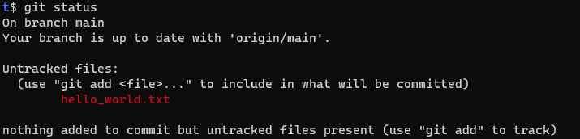

* I add the file to staging and commit:

```sh
$ git add hello_world.txt
```

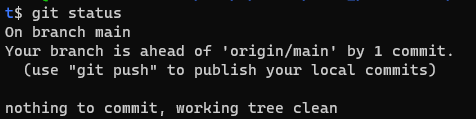

* I check the log:

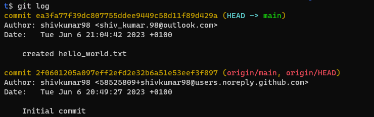

* I modify the README.md file and save it:

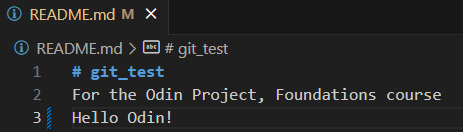

* I also add a line to `hello_world.txt` and add all files to staging and commit:

```sh
git add .
$ git commit -m "edited README and hello_world.txt"
```

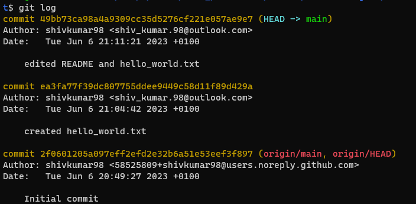

* I try to push but get asked for my username/password. I realised I made a mistake when cloning by using the HTTPS URL.😰

* I correct this problem by setting the remote:

```sh
$ git remote set-url origin git@github.com:shivkumar98/git_test.git
```

* I then CAN push!:

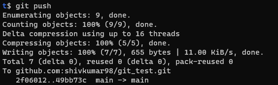

* I check the repo on github and can see my changes did come through:

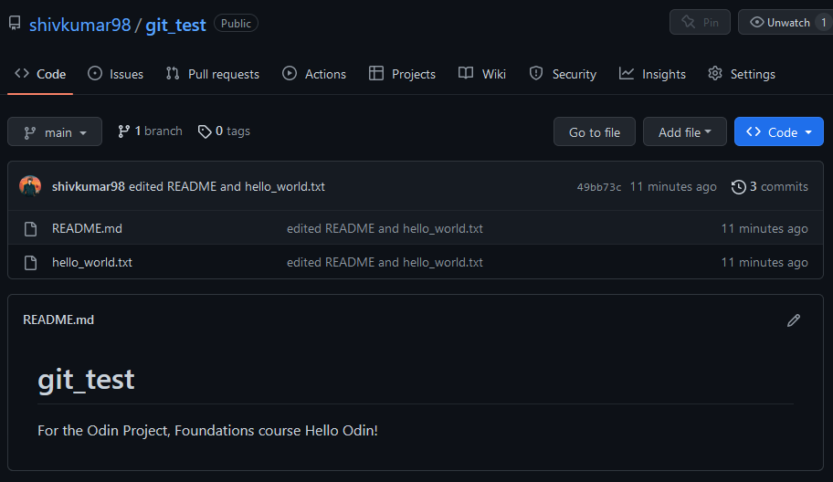

<hr>

# 🧠 3 HTML Foundations

## 🟦 3.1 Introduction to HTML and CSS

### 🔴 3.1.1 Introduction

* HTML is the raw data that a website is built out of, all the texts, links, cards, lists and buttons are created in HTML

* CSS adds style to the above elements

<br>


## 🟦 3.2 Elements and Tags

* Elements are pieces of content wrapped in tags `<>`. E.g. `<p>` is an element.

* Some elements require a closing tag after the content - e.g. `<p>content</p>`, others are self closing like `<br/>` and ``


<br>


## 🟦 3.3 HTML Boilerplate

### 🔴 3.3.1 Creating an HTML File

* I create a HTML file called `index.html` [here](/0%20Foundations%20Course/Examples/1%20HTML%20Boilerplate/index.html).

* We typically name the homepage of our websites as `index.html`

### 🔴 3.3.2 The DOCTYPE

* Every HTML page starts with the doctype declaration - this it to tell the browser which version of HTML should be used for rendering❗

* For HTML5, we use the following declaration:

```html
<!DOCTYPE html>
```

### 🔴 3.3.3 HTML Element

* The ROOT ELEMENT of a HTML file is `<html>`. We can specify the lang attribute as "en" to enable assistive technologies:

```html
<!DOCTYPE>
<html lang="en">
</html>
```

### 🔴 3.3.4 Head Element

* The `<head>` element is where we can add meta-data for our webpage.

* We should always have a meta tag which defines the character set

* The `<title>` element is defined within the head (this is seen in the tab name), if we do not specify then it defaults to filename

```html
<!DOCTYPE>
<html lang="en">
   <head>
      <meta charset="utf-8">
      <title>My webpage</title>
   </head>
</html>
```

### 🔴 3.3.5 Body Element

* The `<body>` element is used to contain all the user-displayed data


### 🔴 3.3.6 Viewing HTML Files in Browser

* TOP recommends using Google Chrome! ❗

* We can open a HTML file in linux using:

```sh
google-chrome index.html
```

<br>


## 🟦 3.4 Working with Text

* In this lesson, we shall see common text-based elements

### 🔴 3.4.1 Paragraphs

* Suppose we have the following HTML, how will it render?

```html
<body>
  Lorem ipsum dolor sit amet, consectetur adipiscing elit, sed do eiusmod tempor
  incididunt ut labore et dolore magna aliqua.

  Ut enim ad minim veniam, quis nostrud exercitation ullamco laboris
  nisi ut aliquip ex ea commodo consequat.
</body>
```

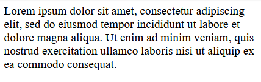

* In order for the text to come out in paragraphs, we must use the `<p>` tags:

```html
<body>
<p>Lorem ipsum dolor sit amet, consectetur adipiscing elit, sed do eiusmod tempor
incididunt ut labore et dolore magna aliqua.</p>

<p>Ut enim ad minim veniam, quis nostrud exercitation ullamco laboris
nisi ut aliquip ex ea commodo consequat.</p>
</body>   
```

### 🔴 3.4.2 Headings

* There are 6 different levels for headings: `<h1>` to `<h6>`

### 🔴 3.4.3 Strong Element

* We use `<strong>` makes text **bold**

### 🔴 3.4.4 Em Element

* The `<em>` element makes text *italic*

### 🔴 3.4.5 Nesting and Indentation

* Elements can be nested within each other. E.g. we can have `<p>` elements within the `<body>` element.

* We use indentation to convey nesting more clearly!

### 🔴 3.4.6 HTML Comments

* Comments are enclosed within `<!--` and `-->`

<br>


## 🟦 3.5 Lists

### 🔴 3.5.1 Unordered Lists

* We create unordered lists using `<ul>`. E.g.:

```html
<ul>
   <li>Item 1</li>
   <li>Item 2</li>
   <li>Item 3</li>
</ul>
```

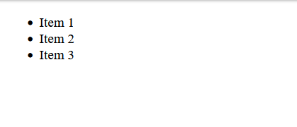

### 🔴 3.5.2 Ordered Lists

* Ordered lists are using `<ol>. E.g.:

```html
<ol>
   <li>Item 1</li>
   <li>Item 2</li>
   <li>Item 3</li>
</ol>
```

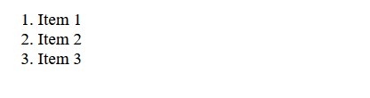

### 👨‍💻 3.5.3 Assignment - Lists 👨‍💻

#### 📜 Instructions 📜

* Create a new HTML document and create the following lists:

1) An unordered shopping list of your favourite foods

2) An ordered list of todo's you need to get done today

3) An unordered list of places you'd like to visit some day

4) An ordered list of you all time top 5 favourite video games

#### 💻 Commentary 💻

* I work on this assignment [here](/0%20Foundations%20Course/Assignments/2%20Lists/)

* I create a HTML file:

```html
<!DOCTYPE html>
<html>
    <head lang="en">
        <meta charset="utf-8">
        <title>My lists</title>
    </head>
    <body>
        <h2>Unordered list of favourite foods:</h1>
        <ul>
            <li>Chicken Tikka Masala</li>
            <li>Chowmein</li>
            <li>Kebab</li>
        </ul>
        <h2>Ordered list of todo's</h2>
        <ol>
            <li>Finish HTML Foundations on TOP</li>
            <li>Phone the pharmacy</li>
            <li>Go to the shop</li>
            <li>Prepare dinner</li>
        </ol>
        <h2>Unordered list of places I'd like to visit</h2>
        <ul>
            <li>Paris</li>
            <li>New York</li>
            <li>Canada</li>
        </ul>
        <h2>An ordered list of top 5 video games</h2>
        <ol>
            <li>The Last of Us</li>
            <li>inFamous 2</li>
            <li>Sly Cooper</li>
            <li>Beyond: Two Souls</li>
            <li>Danganronpa</li>
        </ol>
    </body>
</html>
```

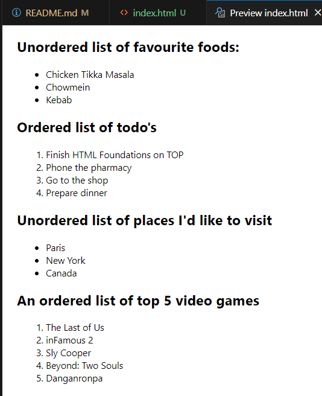

<br>


## 🟦 3.6 Links and Images

* We shall see how to create links to other pages on your own website, display an image using HTML and understand the difference between absolute and relative links

* I prepare for this section by creating a HTML file [here](/0%20Foundations%20Course/Examples/2%20Links%20and%20Images/odin-links-and-images/index.html)


### 🔴 3.6.1 Anchor Elements

* Anchor `<a>` elements are used for creating clickable links:

```html
<a>Click me</a>
```

* We add `href` attribute to specify the link:

```html
<a href="https://www.theodinproject.com/about">click me</a>
```


* If href is not specified then the anchor will appear as plain text, otherwise it gets higlighted in blue.


### 🔴 3.6.2 Absolute and Relative Links

* 🎃 Absolute links are used to link to pages on the internet (and not part of your website). E.g. `https://www.theodinproject.com/about` 🎃

* Relative links are used for pages within our own website.

* I create another HTML file in the [odin-links-and-images](/0%20Foundations%20Course/Examples/2%20Links%20and%20Images/odin-links-and-images/) directory - `about.html`

* Within the `index.html` file, I make a link to the `about.html` page:

```html
<a href="about.html">About</a>
```


* We can organise our HTML files better, typically the `index.html` is within the root directory and other pages are in a subdirectory.

* I move `about.html` to a new directory [pages](/0%20Foundations%20Course/Examples/2%20Links%20and%20Images/odin-links-and-images/pages/)
 
* ⚠️ The link for the anchor is now broken! ⚠️

* I update the relative link:

```html
<a href="pages/about.html">About</a>
```

### 🔴 3.6.3 Images

* We can display images using a self-closing `` tag. We specify the image's location with the `src` attribute

* I add TOP logo to my `index.html` page:

```html

```

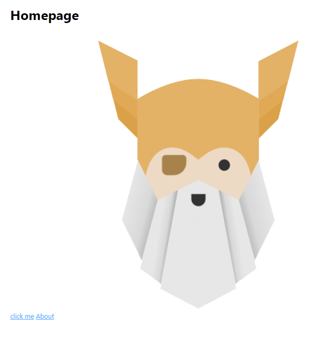

* If we want to use an image stored on our website server, then we can use relative links.

* I saw an image in a new directory [images](/0%20Foundations%20Course/Examples/2%20Links%20and%20Images/odin-links-and-images/images/dot.jpg).

* I add a new image element:

```html

```

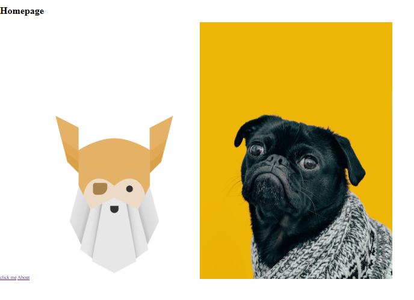

### 🔴 3.6.4 Parent Directories

* Let's suppose we want to add `dot.jpg` to th about page which is in a seperate directory to the `images` directory. We can reference the parent directory using `../`:

```html

```

* The image is displayed as expected

### 🔴 3.6.5 Alt Attribute

* Every image element must also have an `alt` atttibute which describes the image. This will be displayed if the image cannot be loaded. Also helps with screen readers

```html

```


### 🔴 3.6.6 Four Main Image Formats

* There are 4 main image formats used on the web which are designed for different purposes. The 4 main types are:

1) JPG ✅

2) GIF ✅

3) PNG ✅

4) SVG ✅

* JPG is designed for handling large color palletes without increasing file size too much! It does not allow for transparency!

* GIFs are the perfect for simple animations but they are limited for color pallate

* PNG is great for images which do no need realism or animation, they allow for transparency and do not have palette limitations so they are good for icons and logos

* SVG are vector based graphics which means they can scale up and down without loss of quality

<br>


## 🟦 3.7 Project - Recipes

* In this project, I create a basic recipe website which will consist of a main index page which will have links to a new recipes.

* My solution to this project can be found [here](/0%20Foundations%20Course/Projects/1%20Recipes/README.md)

<hr>

# 🧠 4 CSS Foundations

## 🟦 4.1 Introduction to CSS

### 🔴 4.1.1 Introduction

* CSS is used for styling our HTML! We shall look at selectors, property and values from CSS

* In order to target unique elements from the HTML we must use class/id selectors!

* If we create a CSS rule for a class, then these style will apply to the element itself AND ALL child elements

* It's not advised to use CSS to target ids ⚠️

* We can group selectors together by seperating the selections with commas

### 🔴 4.1.2 Scrimba Example

* Suppose we have the following HTML:

```html
<!DOCTYPE html>
<html lang="en">
 <head>
    <meta charset="UTF-8" />
    <meta name="viewport" content="width=device-width, initial-scale=1.0" />
    <title>Recipe Card</title>
    <link rel="stylesheet" href="./index.css" />
 </head>
 <body>
    <div class="container" id="container">
        <div class="recipe-card feature">
            
            <div class="recipe-content">
                <h1>Red Velvet Cupcakes</h1>
                <p>This red velvet cupcake recipe yields soft, fluffy cupcakes with a rich chocolate flavor and a vibrant red color. Topped with a creamy and tangy cream cheese frosting, these cupcakes are perfect for any occasion and are sure to impress your guests.</p>
                <section class="recipe-info">
                    <ul>
                        <li class="recipe-prep-time">
                            <h2>Preparation Time</h2>
                            <p>30 min</p>
                        </li>
                        <li>
                            <h2>Total Time</h2>
                            <p>40 min</p>
                        </li>
                        <li>
                            <h2>Yield</h2>
                            <p>40 min</p>
                        </li>
                    </ul>
                </section>
            </div>                            
            <a href="#">View recipe</a>
        </div>
  </div>
 </body>
</html>

```

* How can we target `h2` and `a` only within the `recipe-card` class? We would write the class name before specifying the element like so:

```css
.recipe-card h2,
.recipe-card a {
  text
}
```

* This produces:

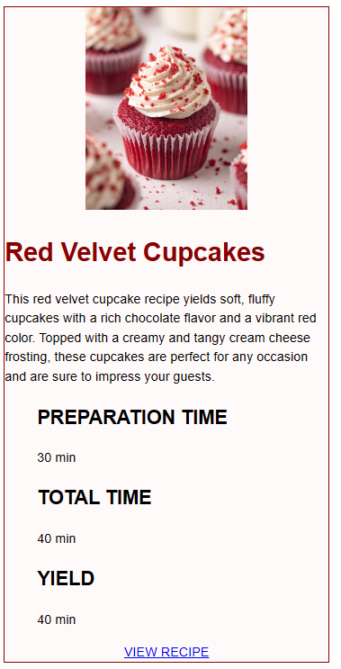


### 🔴 4.1.3 Selectors

* The 🌎UNIVERSAL🌎 selector is an asterisks which targets ALL elements:

```css
* {
  color: purple;
}
```

* A TYPE selector targets a HTML type:

```css
div {
  color: white
}
```

* A 🏫CLASS🏫 selectors targets all HTML elements with the specified class

```html
<div class="alert-text">Please agree to our terms of service.</div>
```

```css
.alert-text {
  color: red;
}
```

* An 🪪ID🪪 selector should be used very sparingly!

#### ⭐ Grouping Selectors ⭐

* We can GROUP selectors together to avoid duplicating CSS styles:

```css
.read { color: white; background-color: black; }
.unread { color: white; background-color: black; }

/* we can group the above together to: */
.read, .unread {
   color: white;
   background-color: black;
}
```

#### ⭐ Chaining Selectors ⭐

* Suppose we have the following HTML:

```html
<div>
  <div class="section header">Latest Posts</div>
  <p class="section preview">This is a preview</p>
</div>
```

* Supose we only want to target the `subsection` AND `header` class, we can ⛓️CHAIN⛓️ our selectors

```css
.section.header {
  color: red;
}
```

* We can also chain an class and ID:

```html
<div>
  <div class="section header">Latest Posts</div>
  <p class="section" id="preview">This is a preview</p>
</div>
```

```css
.section#preview {
  color: gray;
}
```

#### ⭐ Descendant Combinator ⭐

* Descendant selectors let us specify selectors WITHIN another selector.

```css
.ancestor .child {
  /* this will only target .child classes contained within .ancestor classes */
}
```

 * We can also specify the child of a child, and so on...

### 🔴 4.1.4 Order Matters

* If we target to selectors at the same level of specificity, then the last rule will have most precedence.

* Suppose we have the following HTML:

```html
<div>
    <div class="section header">Latest Posts</div>
    <p class="section preview">This is a preview</p>
</div>
```

* and CSS:

```css
  .section {
      background-color: orange;
  }
  .header {
      background-color: blue;
  }
  .section, .header {
      background-color: aqua;
  }
```

* Without the final CSS rule overriding the first and second rules, it would look like:

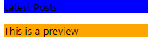

* But if it is included, then both backgrounds are aqua:

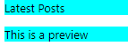

### 🔴 4.1.5 Properties to Get Started With

#### ⭐ Color and Background-Color ⭐

* `color` sets the colour of FONT, while `background-color` sets colour of the background

* We can specify colours using their names, Hex value, RGB value and HSL values:

```css
p {
  color: #FF0000 /* RED */
}
p {
  color: rgb(255,0,0); /* RED */
}
p {
  color: hsl(0,100%,50%); /* RED */
}
```

#### ⭐ Typography Basics and Text-Align ⭐

* `font-family` lets us specify a list of values which determines font.

* We can specify the font-family using a "font family name" using quotes (e.g. "Tikmes New Roman"), OR using a "generic family name" (e.g. sans-serif)

* If the browser does not support a font, it will fallback to the next font in the list. It's best practive to use a generic family name font as fall back:

```css
p {
  font-family: "Times New Roman", sans-serif;
}
```

* `font-size` will set the size of a font:

```css
p {
  font-family: 22px;
}
```

* `font-weight` affects boldness of text. We can specify its value using a keyword OR a numericcal values between 1-1000:

```css
p {
  font-weight: 700 /* equivalent to bold */
}
```

* `text-align` lets you specify allignment. You can set its value to `left`/`right`, `center`, or `justify`:

```css
p {
  text-align: justify;
}
```

#### ⭐ Image Height and Weight ⭐

* Height and weight is NOT restricted to just images, but we shall focus on these first

* If we do not specify `height`/`width` for an `` element, then its values default to the files height and width.

* ❗If we want to modify these properties but maintain the scale of the image, then we should use `auto` for the property we do not set❗ E.g.:

```css
img {
  height: auto;
  width: 500px;
}
```

* It is best practice to set the width/heigh properties even if you do not change from original values. If we do not specify, then when the page is loading, the image will "pop" into place causing other elements to shift. If it is specified, then it leaves a static space.😱 

### 🔴 4.1.6 Adding CSS to HTML

* There are several ways to add CSS to our HTML files:

#### ⭐ External CSS ⭐

* We can reference a CSS file externally from out HTML file by specifying a `link` element in the head of the HTML. 

* E.g. suppose we have a CSS file called `styles.css`:

```html
<!-- index.html -->
<head>
  <link rel="stylesheet" href="styles.css">
</head>
```

#### ⭐ Internal CSS ⭐

* An internal CSS places ass CSS rules within `<style></style>` tags within the `<head>` element of the HTML

#### ⭐ Inline CSS ⭐

* We can write CSS rules directly within an element, e.g.:

```html
<body>
  <div style="color: white; background-color:black"></div>
</body>
```

* This method is not recommended, but can be useful when you want to target a unique element!

### 👨‍💻 4.1.7 Assignment - CSS Exercises 👨‍💻

* For this assignment, I forked a repo [CSS Exercises](https://github.com/TheOdinProject/css-exercises)

* I completed exercises 1-5 on 23/06/2023! See my solutions [here](https://github.com/shivkumar98/css-exercises)

<br>

## 🟦 4.2 The Cascade

### 🔴 4.2.1 Lesson Overview

1) What the cascade does
2) Specificity and combining CSS selectors
3) How inheritance affects certain properties

### 🔴 4.2.2 Scrimba Video Tutorial

* We may have unexpected CSS behaviour, this can be due to the following reasons:

1) The broswer stylesheet
2) Incorrect CSS values
3) Conflicts in the cascade

* The cascade determines which rule will be applied when we have multiple rules for the same item. 

* Specificity values determine which rule will override the others. Here is a table of the specificity values:

| Selector    | Value     | Example   |
| ------------|-----------|-----------|
| Type selector | 1   | img {}      |
| Class selector | 10   | .recipe-card {} |
| ID selector   | 100   | #container {} A|

* Suppose we have the following HTML:

```html
<!DOCTYPE html>
<html lang="en">
 <head>
    <meta charset="UTF-8" />
    <meta name="viewport" content="width=device-width, initial-scale=1.0" />
    <title>Recipe Card</title>
    <link rel="stylesheet" href="index.css" />
 </head>
 <body>
    <div class="container" id="container">
        <div class="recipe-card feature">
            
            <div class="recipe-content">
                <h1>Red Velvet Cupcakes</h1>
                <p>This red velvet cupcake recipe yields soft, fluffy cupcakes with a rich chocolate flavor and a vibrant red color. Topped with a creamy and tangy cream cheese frosting, these cupcakes are perfect for any occasion and are sure to impress your guests.</p>
                <section class="recipe-info">
                    <ul>
                        <li class="recipe-prep-time">
                            <h2>Preparation Time</h2>
                            <p>30 min</p>
                        </li>
                        <li>
                            <h2>Total Time</h2>
                            <p>40 min</p>
                        </li>
                        <li>
                            <h2>Yield</h2>
                            <p>40 min</p>
                        </li>
                    </ul>
                </section>
            </div>                            
            <a href="#">View recipe</a>
        </div>
  </div>
 </body>
</html>
```

* The page looks something like this:

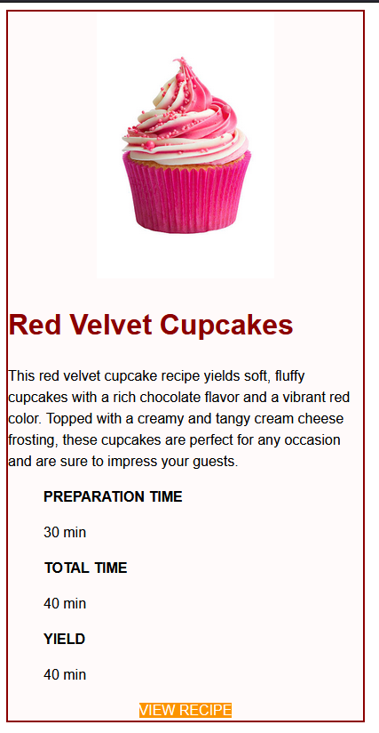                                           

* Suppose we have the following CSS rules:

```css
.recipe-card.feature { /* specificity: 10+10=20*/
    background-color: yellow;
}

.recipe-card { /* specificity: 10 */
    background-color: green;
}
```

* What will the background colour be?🤔

* ANSWER: Yellow✅✅

* Why? Because the first rule is MORE SPECIFIC! We can see this is the case by calculating the specificity value (`20 > 10`).

* Now suppose we apply the background color to the div element using an INLINE element:

```html
<div class="recipe-card feature" style="background-color:orange">
```

* What will the background color be? It will be orange! Inline elements have a specificity of 1000!

* Suppose we want to make the text within the div with class `recipe-content` white with inline styles:

```html
<div class="recipe-content" style="color: white;">
```

* This makes all the text white:

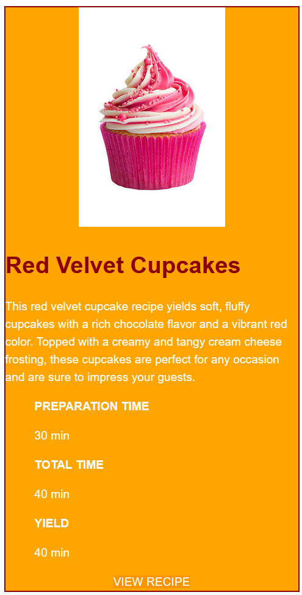

* But wait, the `<h1>` element retains its original styling😱 Why? This is due to **inheritance**! Typographical properties such as `color`, `font-size`, `font-family` are inherited!


### 🔴 4.2.3 The Cascade of CSS

* CSS obeys the algorithms determined by its creators!

* Other issues, such as gaps between elements, can be due to the way the broswer running the webpage renders the CSS.

* When things are not behaving as we expect, this is usually due to the way CSS rules conflict and override each other. This brings us to the Cascade!

* The 🎃cascade🎃 determines which CSS rule gets applied when we have multiple rules for the same target.

#### ⭐ Specificity ⭐

* Specifity is used to determine what rule is applied when we have multiple and conflicting declarations targeting an element.

* The order or precedence is: `ID > class > element` - I.e. ID selectors have the highest specificity

* ⚠️If two rules have the same specificity, then the CSS behaves as if there is no specificity and will apply the rule which is defined latest.⚠️

* E.g. 1, chained classes are more specific:

```html
<!-- index.html -->
<div class="main">
  <div class="list subsection"></div>
</div>
```

```css
.subsection { /* IGNORED */
  color: blue;
}
.main .list { /* chained selector => more specific*/
  color: red;
}
```

* E.g. 2, ID selector is more specfic than chained

```html
<!-- index.html -->
<div class="main">
  <div class="list" id="section"></div>
</div>
```

```css
.main .list { /* IGNORED */
  color: white;
}
#section {
  color: black; /* APPLIED */
}
```

* E.g. 3, additional selectors increase specificity

```html
<div id="section">
    <div class="main">
        <div class="list" >TEXT</div>
    </div>
</div>
```

```css
#section .list { /* APPLIED IF RULE 2 NOT PRESENT */
    background-color: yellow;   
}
#section .main .list { /* RULE 2 */
    background-color: red;
}
```

* E.g. 4, special symbols do not change specificity:

```html
<div class="class1">
  <div class="class2" >TEXT</div>
</div>
```

```css
.class1 .class2 { /* APPLIED IF RULE 2 NOT PRESENT */
    background-color: yellow;   
}
.class1 > .class2 { /* RULE 2 */
    background-color: red;
}
```

### 👨‍💻 4.2.4 Assignment - Cascade Fix 👨‍💻

* This assignment is a continuation fo the CSS exercises!

* I completed this assignment on 25/06/2023! See my solution to this exercise [here](https://github.com/shivkumar98/css-exercises#-exercise-6-cascade-fix-)


### 👨‍💻 4.2.5 Assignment - Update The Recipe Project 👨‍💻

* I created a Repo where I create a basic website for my recipes([link](https://github.com/shivkumar98/odin-recipes))

* I finished this assignment on 25/06/2023

* I added a CSS file which is referenced by all the pages. The website now looks like:


* I defined the CSS as:

```css
* {
    font-family:'Segoe UI', Tahoma, sans-serif;background-color: rgb(220, 168, 239);
}
body {
    text-align: center;
}
a {
    font-size: 24px;
    font-weight: bold;
    color: rgb(62, 62, 62);
}
h1 {
    background-color: rgb(151, 98, 201);
}
h2 {
    background-color: rgb(119, 119, 240);
}
ul, p, li {
    font-size: 20px;
}
```