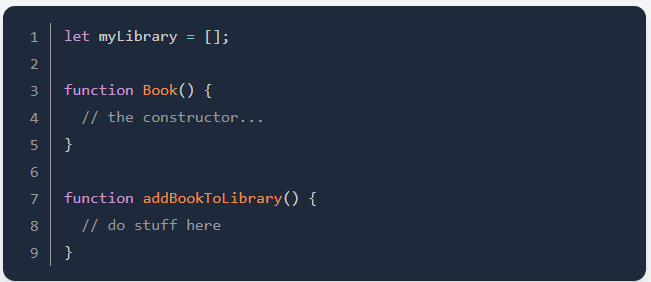

# Project 1: Library

## Assignment

1) Setup your project with skeleton HTML/CSS and JS files.

2) All of your Book object will be stored in a simple array, so add a function to the script that takes user's input and store the new book object into an array. The code should look something like:

3) Write a function that loops through the array and displays each book on the page. You can display them in some sort of table, or each on a "card"

4) Add a "NEW BOOK" button that brings up a form allowing users to inpur the details for the new book: author, title, number of pages, whether it's been read and anything else you might want on it

* Use `event.preventDefault()` to prevent the form from submitting to the server!

5)  Add a button on each book's display to remove the book from the library.

* You will need to associate your DOM elements with the actual book object in some way. One easy solution is giving them a data-attribute that corresponds to the index of the library array.

6) Add a button each book's display to change its `read` status

* You will want to create a function which toggles the books `read` status