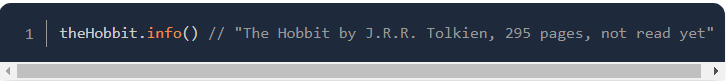
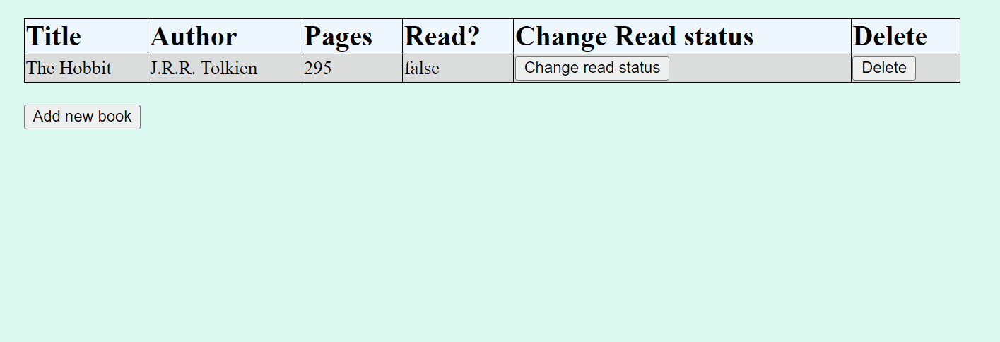

<link rel="stylesheet" href="../../styles.css">

# 🟪 JavaScript Course

## 🟦 Overview

* I will make dynamic and interactive websites by creating features and stand-alone applications. This module includes projects where I will learn to manipulate the DOM, use OOP principles, and build single page applications with React.


# 🧠 1 Introduction

## 🟦 1.1 How This Course Will Work

### 🔴 1.1.1 Introduction

* JavaScript is becoming a giant in web space, more logic is being passed to the client-side to give fast user experiences. It is also being used on server side with `Node.js`

### 🔴 1.1.2 The Path

* There are no pre-requisites for this course. The final project will integrate everything you've done in this curicullum

### 🔴 1.1.3 Format

* The course is broken up to the bite-sized lessons and their accompanying projects.

<br>

## 🟦 1.2 A Quick Review

### 🔴 1.2.1 jQuery?

* jQuery is NOT included in this curriculum.

<hr>

# 🧠 2 Organising your JavaScript Code

## 🟦 2.1 Introduction

### 🔴 2.1.1 Organising your JavaScript Code

* JavaScript is very forgiving in the way code is organised unlike languages like Java.

* This makes making small additions to your application incredibly easy but maintaining the code gets complex when there are lots of lines of code.

* This series of lessons will cover the most common design patterns which are present in modern JavaScript. These patterns include:

- Plain Old JavaScript Objects and Object Constructors✅

- Factory Functions and the Module Pattern✅

- Classes✅

- ES6 Modules✅

### 🔴 2.1.2 Additional Resources:

- [You Don't Know JS](https://github.com/getify/You-Dont-Know-JS/tree/1st-ed#titles) - this is a GitHub book about how JavaScript works under the hood

- [Namaste JavaScript](https://www.youtube.com/playlist?list=PLlasXeu85E9cQ32gLCvAvr9vNaUccPVNP) - This is YouTube playlist about JavaScript

<br>

## 🟦 2.2 Objects and Object Constructors

### 🔴 2.2.1 Introduction

* We can define objects in different ways, but the best way is to use `object literal` syntax:

```javascript
const myObject = {
    name: 'Shiv Kumar',
    age: 77,
    "obnxious property": function() { /* do stuff*/  }
}
```

* We can access properties from this object in two ways:

1) Dot notation `myObject.propertyName`

2) Bracket notation `myObject[propertyName]

* We can only use dot notation on a property without a space, it will take anything after the '.' as the property name => variables do not work:

```javascript
myObject."property" // COMPILER ERROR

const variable = 'name'
myOject.variable // undefined as this is getting the value for property 'variable'
```

* The bracket notation DOES ALLOW for spaces and variables:

```javascript
myObject["obnxious property"] // [Function: obnxious property]

const variable = 'name'
myObject[variable] // Shiv Kumar
```

### 🔴 2.2.2 Lesson Overview

Here is a general overview of the topics in this lesson:

* How to write an object constructor and instantiate the object ✅

* Describe what's a prototype and how to to use it ✅

* Explain inheritance of prototypes ✅

* Understand the guidelines of prototypical inheritance ✅

* Explain what `Object.create` does ✅

* Explain what the `this` keyword ✅


### 🔴 2.2.3 Object as a Design Pattern

#### 🔺 An Example 🔺

* Let's look at how we would make a game of Tic Tac Toes WITHOUT using objects. The code would look something like:


```javascript
const playerOneName = "Shiv"
const playerTwoName = "Sammy"
const playerOneMarker = "X"
const playerTwoMarker = "O"

console.log(playerOneName)
console.log(playerTwoName)
```

* Instead of writing code using variables, we can set up OBJECTS:

```javascript

const playerOne = {
    name: "Shiv",
    marker: "X",
    points: 10
}

const playerTwo = {
    name: "Sammy",
    marker: "O",
    points: 5
}
```

* Objects enable us to access properties:

```javascript
function printName(player){
    console.log(player.name)
}

printName(playerOne) // Shiv

function gameOver(winningPlayer) {
    console.log(winningPlayer.name + " is the winner!")
}
```

### 🔴 2.2.4 Object Constructors

* We can define a CONSTRUCTOR function which can be used to instantiate an object:

```javascript
function Player(name, marker) {
    this.name = name;
    this.marker = marker;
}
```

* We call the constructor with the `new` keyword to actually create an instance:

```javascript
const player = new Player('steve', 'X')
```

* We can also define a method within a constructor, such that all instance have a function defined on them:

```javascript
function Player(name, marker){
    this.name=name;
    this.marker=marker;
    this.sayName = function() { console.log(this.name)}
}

const player1 = new Player("steve", "X")
const player2 = new Player("stephanies", "O")

player1.sayName() // steve
player2.sayName() // stephanies
```

### 🔴 2.2.5 Exercise 🔴

* Write a constructor for making "Book" objects with the following properties: `title`, `author` number of `pages`, and whether or not the book has been `read`

* Put a function in the constructor which will return a string like:



#### 🔺 Solution: 🔺

```javascript
function Book(title, author, pages, read){
    this.title = title;
    this.author = author;
    this.pages = pages;
    this.read = read;
    this.info = function(){
        return title+" by "+author+", "+pages+" pages"+ ", "+(read?"has been read":"not read yet")
    }
}
const theHobbit = new Book("The Hobbit",
"J.R.R. Tolkien", 295, false) 
console.log(theHobbit.info()) // The Hobbit by J.R.R. Tolkien, 295 pages, not read yet
```

### 🔴 2.2.6 The Prototype 

* EVERY object in JS has a `prototype`, this implies that `prototype` is an object itself!

* Therefore, we can access the prototype of an object by calling `object.prototype`

* The `.prototype` property points to the REFERENCE of the object prototype. Hence we can check if two objects from the same constructor have the same prototype.

* We can access an object's prototype by calling `Object.getPrototypeOf(object)`

```javascript
function Player(name, score){
    this.name = name;
    this.score = score; }
const player1 = new Player("Shiv", 1);
console.log(Object.getPrototypeOf(player1) === Player.prototype) // true
```

#### 🔺 `Object.getPrototypeOf()` vs. `.proto` vs. `[[Prototype]]` 🔺

* `Object.getPrototypeOf()` is the standard way of accessing the prototype

* We can achieve the same thing by accessing `.__proto__` - this is now deprecated ⚠️

* We can also use `.[[prototype]]` which achieves the same as the above ⚠️
 
#### 🔺 Prototypal Inheritance 🔺

* What is the purpose of defining properties and functions on the prototype🤔🤔🤔

- It can save memory!✅ Rathen than having a property defined for EACH instance, we have it in a centralised shared area.

- Inheritance reduces code duplication ✅ 

* Using the `valueOf()` method on objects:

```javascript
console.log(player1.valueOf()) // Player { name: 'Shiv', score: 1 }
```

* How did `.valueOf()` work when we didn't define it? This is defined in `Object.prototype`! How can we cerify this? We use `.hasOwnProperty()`😱

```javascript
console.log(Object.prototype.hasOwnProperty('valueOf')) // true
console.log( Player.prototype.hasOwnProperty('valueOf')) // false
```

* Where did `.hasOwnProperty()` come from? This is also a function of the `Object` prototype:

```javascript
console.log( Object.prototype.hasOwnProperty('hasOwnProperty')) // true
```

#### 🔺 Recommend Method for Prototypical Inheritance 🔺

* We can use `Object.setPrototypeOf()` to mutate the prototype of an object
```javascript
function Person(name) {
    this.name = name;
}
Person.prototype.sayName = function() {
    console.log(`Hello, I'm ${this.name}`)
}
function PlayerWithInheritance(name, marker){
    this.name = name;
    this.marker = marker
}
Object.setPrototypeOf(PlayerWithInheritance.prototype, Person.prototype)
const playerOne = new PlayerWithInheritance("Shiv", "X")
playerOne.sayName() // Hello, I'm Shiv
```


* ⚠️ We COULD write the following: ⚠️

```javascript
Player.prototype = Person.prototype
```

* But this very quickly becomes problematic so its best avoided!!


#### 🔺 Using `Object.create()` 🔺

* Suppose we want to use an object instance to set the prototype of an object

```javascript
const person = {
  isHuman: false,
  printIntroduction: function() {
    console.log(`My name is ${this.name}. Am I human? ${this.isHuman}`);
  }
};

const me = Object.create(person);
```

* It is also a way to set the prototype of a class:

```javascript
Student.prototype.sayName = function() {
    console.log("name: "+this.name)
}
const studentOne = new Student("Shiv", 11)
Student.prototype.goToProm = function() {
    console.log("Eh.. go to prom?")
}
studentOne.goToProm() // Eh.. go to prom?
EigthGrader.prototype = Object.create(Student.prototype);
function EigthGrader(name) {
    this.name = name;
    this.grade = 8;
}
// we can access the properties of Student prototype:
eighthGrader.sayName() // name: kid
```

<br>

## 🟦 2.3 Project Library

* My solution to this project can be found [here](/1%20Full%20Stack%20JavaScript%20Path/2%20JavaScript/Projects/1%20Library/README.md)

* Here is a quick demo:


